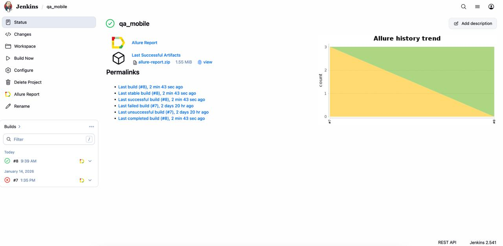
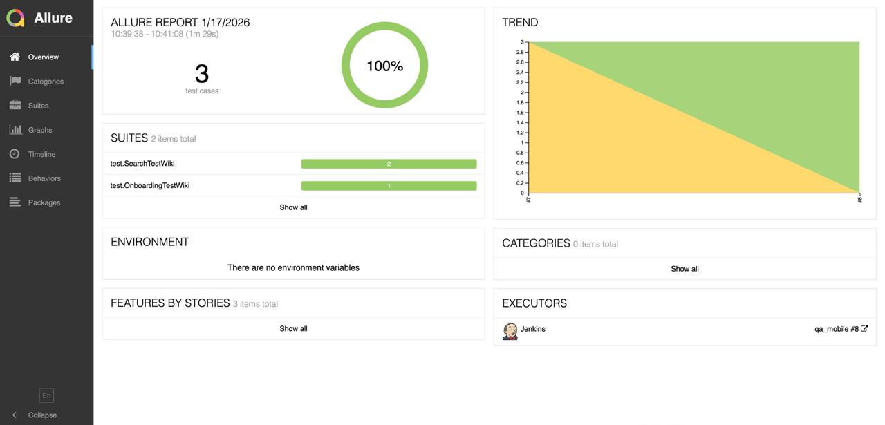
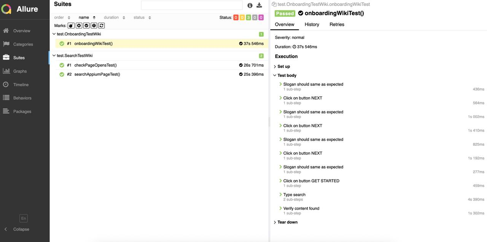
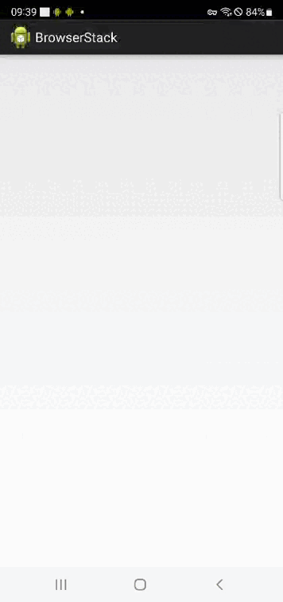

# Test Mobile Automation Project for [Wikipedia](https://github.com/wikimedia/apps-android-wikipedia)

Wikipedia is a free online encyclopedia, created and edited by volunteers around the world and hosted by the Wikimedia Foundation.

## **Contents:**
____

* <a href="#tools">Technologies and tools</a>

* <a href="#cases">Examples of automated test cases</a>

* <a href="#console">Run from terminal</a>

* <a href="#allure">Allure report</a>

* <a href="#allure-testops">Integration with Allure TestOps</a>

* <a href="#telegram">Telegram notifications via bot</a>

* <a href="#video">Example videos of test execution on Selenoid</a>
____
<a id="tools"></a>
## <a name="Technologies and tools">**Technologies and tools:**</a>

<p align="center">  
<a href="https://www.jetbrains.com/idea/"></a>  
<a href="https://www.java.com/"></a>  
<a href="https://github.com/"></a>  
<a href="https://junit.org/junit5/"></a>  
<a href="https://gradle.org/"></a>  
<a href="https://selenide.org/"></a>  
<a href="https://aerokube.com/selenoid/"></a>  
<a href="ht[images](images)tps://github.com/allure-framework/allure2"></a> 
<a href="https://qameta.io/"></a>   
<a href="https://www.jenkins.io/"></a>
</p>

____
<a id="cases"></a>
## <a name="Examples of automated test cases">**Examples of automated test cases:**</a>
____
- ✓ *Verify search works and shows certain page*
- ✓ *Verify page is opened after click on it*
- ✓ *Verify that onboarding instruction gives all expected action*

____
<a id="jenkins"></a>
## </a><a name="Build"></a>Build in [Jenkins](https://jenkins.autotests.cloud/job/qa_mobile/)</a>
____
<p align="center">  
<a href="https://jenkins.autotests.cloud/job/qa_mobile/"></a>  
</p>


### **Build parameters in Jenkins:**

- *deviceHost(browserstack, emulation)

for browserstack configuration:
- *userName={userName}
- *accessKey={accessKey}
- *platform=android
- *os_version=12.0
- *device=Samsung Galaxy S22 Ultra

for emulation configuration:
- *platform.name=Android
- *device.name=Pixel 7
- *device.avd =Pixel_7

<a id="console"></a>
## Commands for running from terminal
___
***Local run:***
```bash  
gradle clean test -DdeviceHost=browserstack
```

***Remote run via Jenkins:***
```bash  
clean test
-DdeviceHost={deviceHost}
-DuserName={userName}
-DaccessKey={accessKey}
```
___
<a id="allure"></a>
## </a> <a name="Allure"></a>Allure [report](https://jenkins.autotests.cloud/job/qa_mobile/8/allure/)</a>
___

### *Main report page*

<p align="center">  </p>

### *Test cases*

<p align="center">  </p>

____
<a id="video"></a>
## </a> Example videos of test execution on Browserstack
____
<p align="center">
   
</p>
